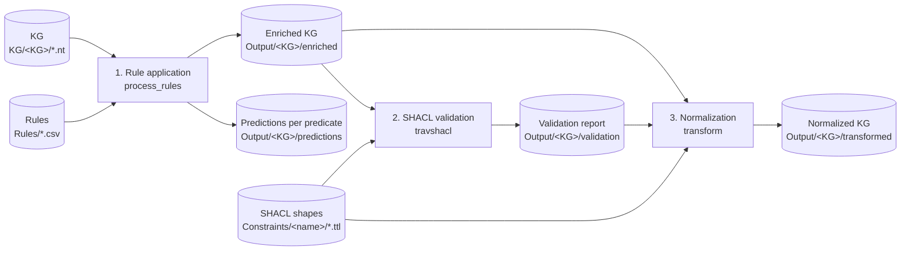

# 01 - Overview and architecture

## What problem VANILLA addresses

Knowledge graph completion (KGC) predicts missing triples, usually with embedding models such as TransE or
TuckER. Two things go wrong with that approach on its own:

1. Embedding models ignore domain logic, so they can predict facts that contradict the domain
   (for example a person who is both the spouse and the child of the same person).
2. The training graph itself often contains such anomalies, and models learn from them.

VANILLA adds symbolic knowledge in two places:

- **Normalization** (part 1): symbolic rules add the facts that logically follow from the graph, SHACL
  constraints detect the nodes that break domain rules, and those anomalies are rewritten in the graph.
- **Validated completion** (part 2): embedding models are trained on the normalized graph, so the effect of
  normalization on link-prediction quality can be measured.

## The two parts

| Part | Folder | Entry point | Input | Output |
|---|---|---|---|---|
| KG Normalization | `KG_Normalization/` | `Symbolic_predictions.py` | KG (`.nt`), rules (`.csv`), SHACL shapes (`.ttl`) | Enriched KG, validation reports, normalized KG |
| Validated KG Completion | `Validated_KG_Completion/` | `KGC.py`, `KGC_hpo.py` | Normalized KG as a TSV file | Trained models, splits, metrics, loss plots |

The rest of this documentation concentrates on part 1, because that is what you configure and run when you
normalize a graph. Part 2 is described in [09](09-validated-kg-completion.md).

## Normalization pipeline at a glance

1. **Rule application.** Horn rules mined from the graph (for example with AMIE) are filtered by PCA
   confidence. Each kept rule is turned into a SPARQL query. Triples that the rules imply and the graph does
   not yet contain are added, producing the *enriched KG*.
2. **SHACL validation.** TravSHACL checks the enriched KG against the SHACL shapes and writes a report that
   lists the violating nodes.
3. **Normalization.** Every triple is first rewritten so its predicate carries the object's name. The
   triples of violating nodes that match a constraint are then renamed with a `No` marker. The result is the
   *normalized KG*.

The three stages run in one go from `Symbolic_predictions.py`. Details are in
[05](05-normalization-pipeline.md).

## Key concepts

**Horn rule.** An implication such as `?a father ?b => ?a parent ?b`: if the body holds, the head should
hold. A rule is an AMIE-style row with a body, a head and quality measures.

**PCA confidence.** Partial completeness assumption confidence: the fraction of the rule's predictions that
are correct, counting only entities for which the head relation is known to be present. VANILLA uses it as
the selection criterion (see [03](03-configuration.md#pca_threshold)).

**SHACL shape.** A constraint on a node. In VANILLA each shape is a SPARQL query (`sh:sparql`) that returns
the nodes that *violate* a domain rule.

**Enriched KG.** The original graph plus the predicted triples from the rules.

**Normalized KG.** The enriched KG after predicate-object expansion and after the violation rewrites.

## Benchmarks bundled with the repository

| Size | Benchmark | Triples | Entities | Relations | Constraints | Valid | Invalid |
|---|---|---|---|---|---|---|---|
| Large | DB100K | 695,572 | 99,604 | 470 | 6 | 390,351 | 62,024 |
| Large | SynthLC-10000 | 106,549 | 10,000 | 9 | 25 | 223,523 | 26,477 |
| Medium | YAGO3-10 | 1,080,264 | 123,086 | 37 | 4 | 393,205 | 58,719 |
| Medium | SGKG | 54,585 | 36,450 | 6 | 5 | 156,965 | 12,150 |
| Small | French Royalty | 10,526 | 2,601 | 12 | 2 | 1,922 | 298 |
| Small | SynthLC-1000 | 10,668 | 1,000 | 9 | 25 | 22,335 | 2,665 |

Inputs and earlier results for these benchmarks are stored under `KG_Normalization/KG/`,
`KG_Normalization/Rules/` and `KG_Normalization/Constraints/`.

> **Note on the French Royalty variants.** The benchmark graph in `KG/FrenchRoyalty/` has 12 relations
> (including `hasSpouse`, `gender`, `name`, `marriedTo`). A simplified variant of the same graph with 8
> relations (`child`, `father`, `mother`, `parent`, `predecessor`, `spouse`, `successor`, `type`, 8,633
> triples) is also in circulation. Rules and shapes written for one variant do not fully apply to the other.
> See [08](08-normalizing-your-own-graph.md).

## Technology

| Component | Library |
|---|---|
| RDF handling, SPARQL | `rdflib` |
| Rule table filtering | `pandas` |
| SHACL validation | `TravSHACL` |
| Embedding models | `pykeen` (with `torch`) |
