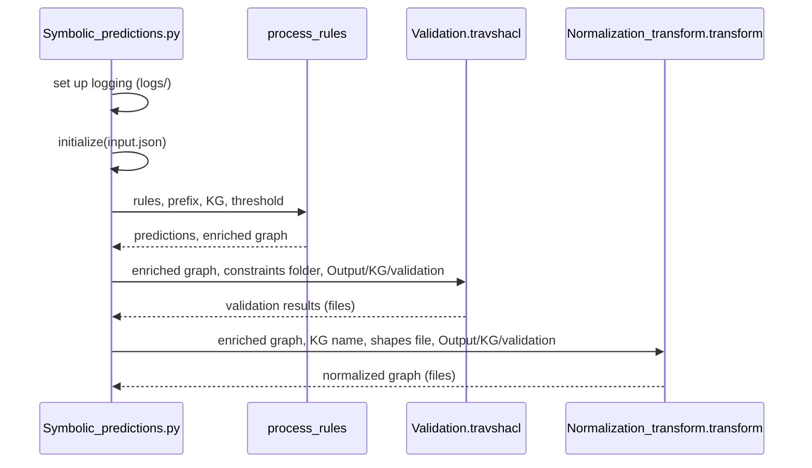

# 05 - The normalization pipeline

This page walks through what happens when you run:

```bash
cd KG_Normalization
python Symbolic_predictions.py
```

The entry point is the `__main__` block of `Symbolic_predictions.py`. It performs, in order: logging setup,
configuration loading, rule application, SHACL validation, and normalization.



## Stage 0 - Start-up

1. A `logs/` directory is created if missing.
2. Logging goes to both the console and `logs/symbolic_predictions_<timestamp>.log`, at level `INFO`
   (the `log_level` key of `input.json` is not read).
3. `initialize("input.json")` reads the configuration and builds all the paths. See
   [03](03-configuration.md#derived-paths).

## Stage 1 - Rule application (`process_rules`)

### 1.1 Validate the rules file

The file must contain the lowercase columns `body`, `head`, `pca_confidence`, `std_confidence` and
`functional_variable`. If any is missing, a `ValueError` listing the missing columns and the columns found is
raised. There are no alternative spellings.

### 1.2 Select rules

The rules are filtered with `pandas` to keep those with `pca_threshold < PCA < 1`, then grouped by `head` and
counted. The heads are processed in descending order of rule count, which is the result of:

```sql
SELECT head, COUNT(*) AS num FROM rules
WHERE pca_confidence < 1 AND pca_confidence > <pca_threshold>
GROUP BY head ORDER BY num DESC
```

For each distinct head, the rules of that head are loaded ordered by `std_confidence`, highest first.
If no rule passes the filter, the function returns an empty result and an empty graph, and the pipeline
still continues to validation and normalization with that empty graph. Check the log for
`No rules found meeting the PCA confidence threshold criteria.`

### 1.3 Rule types

`detect_rule_type` samples up to 10 rules and looks at the object position of every body atom and of the
head. If any of them is not a variable, the type is **constant**, otherwise **variable**.

| | Variable rules | Constant rules |
|---|---|---|
| Example | `?a father ?b => ?a parent ?b` | `?a hasGender Male => ?a type Person` |
| Builder | `rdflib_query_without_constants` | `rdflib_query_with_constants` |
| Query selects | subject and object of the head | only the subject; the object is the constant in the head |
| Predictions look like | `(x, head_predicate, y)` | `(x, head_predicate, constant)` |

### 1.4 Build and run the SPARQL query

For each rule the body atoms become a basic graph pattern, and predicates get the `ex:` prefix. The query
selects the bindings for which the head triple does **not** already exist:

```sparql
PREFIX ex: <http://FrenchRoyalty.org/>
SELECT DISTINCT ?a ?b WHERE {
    ?b ex:successor ?a .
    FILTER(!EXISTS { ?a ex:predecessor ?b })
}
```

If the rule's `functional_variable` is not `?a`, the query is restricted further. The head atom is copied
with `?a` renamed to `?a1`, and it must already hold for some *other* subject:

```sparql
    <body> .
    ?a1 ex:head_predicate ?b .
    FILTER(?a1 != ?a)
    FILTER(!EXISTS { ?a ex:head_predicate ?b })
```

In words: the rule only fires for an object `?b` that the head predicate already links to a different
subject `?a1`. When `functional_variable` is `?a` this extra restriction is skipped and only the
`!EXISTS` filter applies.

Each result becomes a `(subject, head_predicate, object)` row with the namespace prefix removed. Results of
all rules of one head predicate are written to `Predictions/<KG>_predictions/<predicate>.tsv`.

> **Performance.** The graph is re-read from disk for every rule (`load_graph` is called once per query),
> parsed line by line. On graphs of about 10,000 triples with 85 rules a run takes under a minute. On graphs
> of millions of triples this stage dominates the run time.

### 1.5 Build the enriched KG

All predictions are added to an `rdflib` graph that was loaded from the input `.nt`. The result is
serialized to `Predictions/<KG>_enriched/<KG>_enriched.nt`.

A summary is printed and logged: rules used, predictions generated, predictions per rule, and both counts
per predicate.

## Stage 2 - SHACL validation (`Validation.travshacl`)

The enriched graph and the constraints folder are given to TravSHACL with these fixed settings:

| Setting | Value | Effect |
|---|---|---|
| Graph traversal | DFS | Depth-first traversal of the shape dependency graph |
| Heuristics | `TARGET IN BIG` | Prefer shapes with targets, higher in-degree, more constraints first |
| `use_selective_queries` | True | Use selective SPARQL queries |
| `max_split_size` | 256 | Batch size for query results |
| `save_outputs` | True | Write results to the output directory |

The endpoint is the in-memory enriched `rdflib` graph. The results directory is
`Output/<KG>/validation/`, and it is created if it does not exist. It is deliberately **outside** the
constraints folder, because TravSHACL parses every `.ttl` file below the constraints folder as a shape
file. A `validationReport.ttl` left in there by an earlier run would otherwise be parsed as a shape on the
next run and crash it. See [06](06-shacl-constraints.md#why-results-are-kept-outside-the-constraints-folder).

Files written:

| File | Content |
|---|---|
| `validationReport.ttl` | One `sh:ValidationResult` per violation, with `sh:focusNode` and `sh:sourceShape` |
| `stats.txt` | Counts of all, valid and invalid targets, and query statistics |
| `targets_valid.log`, `targets_violated.log` | Lists of nodes |
| `traces.csv`, `validation.log` | Trace of the validation |

## Stage 3 - Normalization (`Normalization_transform.transform`)

Normalization works on the enriched graph and has three steps.

### 3.1 Predicate-object expansion

Every triple `(s, p, o)` is replaced with `(s, p_<local name of o>, o)`:

```
(Afonso_III, spouse, Beatrice_of_Castile)
        ->  (Afonso_III, spouse_Beatrice_of_Castile, Beatrice_of_Castile)
```

The graph keeps the same number of triples, but each triple now has a predicate specific to its object. A
dictionary from each new predicate to the original one is kept. The result is saved to
`Output/<KG>/transformed/<KG>_expanded.nt`.

### 3.2 Read constraints and violations

- `process_shacl_shapes` reads the shapes file (`Constraints/<constraints_folder>/<constraints_folder>.ttl`).
  For every `sh:NodeShape` with an `sh:sparql` query it extracts the triple patterns. These are split into
  *condition patterns* (the main part of the query) and *filter patterns* (inside the one
  `FILTER [NOT] EXISTS { ... }` block). See [06](06-shacl-constraints.md#how-normalization-reads-a-shape).
- `process_validation_report` reads `Output/<KG>/validation/validationReport.ttl` and returns a list of
  `(focus node, source shape)` pairs.

### 3.3 Rewrite the violating nodes

For each `(focus node, shape)` pair:

1. The node must satisfy all the shape's condition patterns in the expanded graph. Otherwise it is skipped.
2. For each triple of that node whose original predicate is a filter-pattern predicate (and whose object
   matches the pattern's object, if the pattern names one), the triple is replaced.

The replacement depends on the kind of filter:

| Filter in the shape | New predicate and object | Effect |
|---|---|---|
| `FILTER EXISTS { ... }` | `<pred>_No<Entity>` and `No<Entity>` | Triple renamed with a `No` marker |
| `FILTER NOT EXISTS { ... }` | `<pred>_<Entity>` and `<Entity>` | **Unchanged**: the prefix is empty, so the triple equals the one already there |

Example for a shape whose filter is `FILTER EXISTS { $this ex:spouse ?mother }`:

```
(Afonso_III, spouse_Beatrice_of_Castile, Beatrice_of_Castile)
        ->  (Afonso_III, spouse_NoBeatrice_of_Castile, NoBeatrice_of_Castile)
```

Marking the triple gives downstream embedding models a different relation and entity for the anomalous
fact, instead of learning it as a normal spouse edge. The triple count does not change; only the names do.

> **`NOT EXISTS` shapes are validated but not rewritten.** They produce entries in the validation report
> and are counted in `Applying N transformations...`, but the "new" triple is identical to the old one.
> If you need violations to change the normalized graph, express the rule as a shape with a
> `FILTER EXISTS` block (the condition that must not co-occur), not as a missing-edge check.

### 3.4 Output

The final graph is written to `Output/<KG>/transformed/<KG>_normalized.nt`, and a summary is printed: original
triples, initially transformed triples, final transformed triples, and violations processed.

## Run summary

For each run you get, under `KG_Normalization/`:

```
Predictions/<KG>_predictions/           <predicate>.tsv, one per predicted predicate
Predictions/<KG>_enriched/               <KG>_enriched.nt
Output/<KG>/validation/                 validationReport.ttl, stats.txt, ...
Output/<KG>/transformed/                <KG>_expanded.nt, <KG>_normalized.nt
logs/                                   symbolic_predictions_<timestamp>.log
```

Re-running with the same `KG` name overwrites these outputs.
